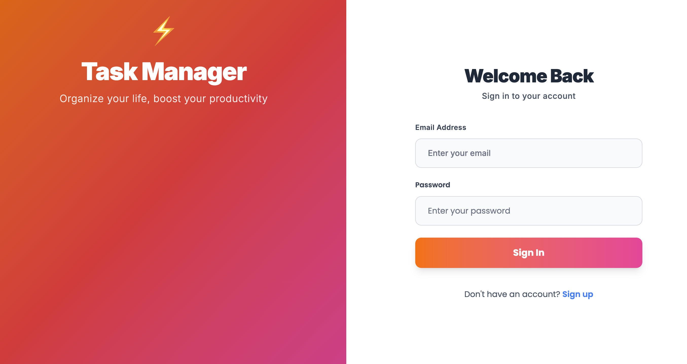

# Task Manager

Modern ve kullanıcı dostu bir görev yönetim uygulaması. Admin ve kullanıcı rolleri ile çalışan, gerçek zamanlı güncellemeler sunan web tabanlı platform.

## 🚀 Özellikler

- **Kullanıcı Yönetimi**: Kayıt olma, giriş yapma, rol tabanlı erişim
- **Görev Yönetimi**: Görev oluşturma, düzenleme, silme, durum takibi
- **Admin Paneli**: Kullanıcı ve görev yönetimi
- **Modern UI**: Responsive tasarım, smooth animasyonlar
- **Gerçek Zamanlı**: Anlık güncellemeler

## 📸 Screenshots


_Modern gradient tasarım ve smooth animasyonlar_

## 🛠️ Teknolojiler

### Frontend

- **React 18** + **TypeScript**
- **Vite** - Hızlı geliştirme
- **Tailwind CSS** - Styling
- **React Router DOM** - Routing
- **Zustand** - State management
- **React Hook Form** + **Yup** - Form yönetimi
- **Axios** - HTTP istekleri
- **React Hot Toast** - Bildirimler

### Backend

- **Node.js** + **Express.js**
- **TypeScript** - Type safety
- **MongoDB** + **Mongoose** - Veritabanı
- **JWT** - Authentication
- **bcryptjs** - Şifre hashleme
- **Zod** - Validation
- **CORS** - Cross-origin requests

## 🎨 UI/UX Özellikleri

- **Gradient Tasarım**: Modern renk geçişleri
- **Smooth Animasyonlar**: Parallax efektleri
- **Responsive**: Mobil uyumlu
- **Inter Font**: Modern tipografi
- **Glassmorphism**: Şeffaf tasarım elementleri

## 🚀 Kurulum

### Backend

```bash
cd backend
npm install
npm run dev
```

### Frontend

```bash
cd frontend/Task-Manager-App
npm install
npm run dev
```

## 📱 Kullanım

1. **Kayıt Ol**: Yeni hesap oluştur
2. **Giriş Yap**: Mevcut hesapla giriş
3. **Görevler**: Görevlerini yönet
4. **Admin**: Kullanıcı ve görev yönetimi (admin rolü)

## 🔧 Geliştirme

- **Frontend**: `http://localhost:3000`
- **Backend**: `http://localhost:5000`
- **MongoDB**: Yerel veya cloud bağlantısı

## 📝 Notlar

- Proje geliştirme aşamasındadır
- Detaylı dokümantasyon yakında eklenecek
- Özellik istekleri ve hata raporları için issue açabilirsiniz

---

**Versiyon**: 1.0.0  
**Lisans**: MIT  
**Geliştirici**: Task Manager Team
